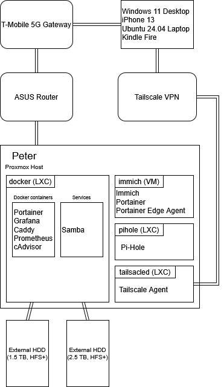

# homelab-docs

Documentation for keeping everything in line with my homelab.

## Network Diagram

## Basic Overview

My "homelab" is a single node setup running Proxmox with a few LXCs and one VM segmented from my main home network behind a private router. Some running services include Immich for personal photo storage, Pi-hole for DNS resolution and tracker blocking, and Tailscale for remote access. I mostly use this as a way to experiment with containerization and virtualization to build skills essential in today's tech landscape.

Other running services include Grafana for monitoring (using Prometheus and cAdvisor as data sources), Portainer for Docker container management, and Caddy as a simple reverse proxy so I can access by services by a local domain name rather than remember IP address and port combinations.

For next steps, I have a couple of external hard drives containing home videos and photos that I'd like to back up and reformat from HFS+ to ext4. I just need enough spare capacity to be able to copy everything off of it, which is a struggle right now.
